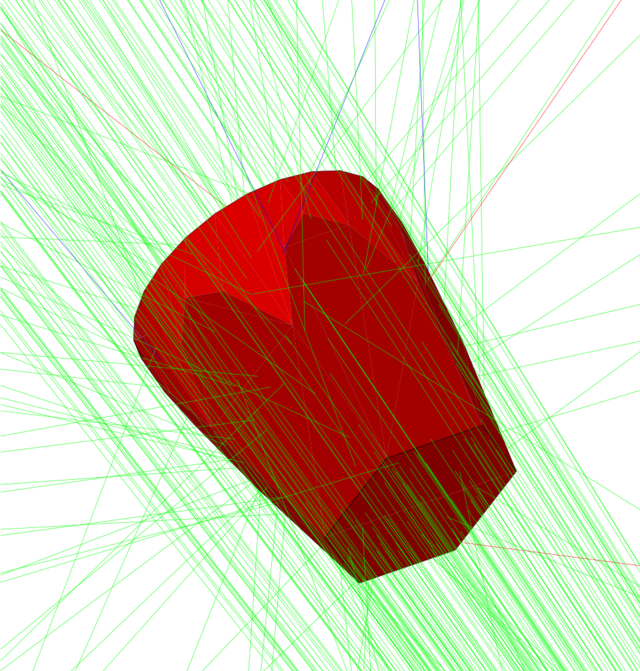
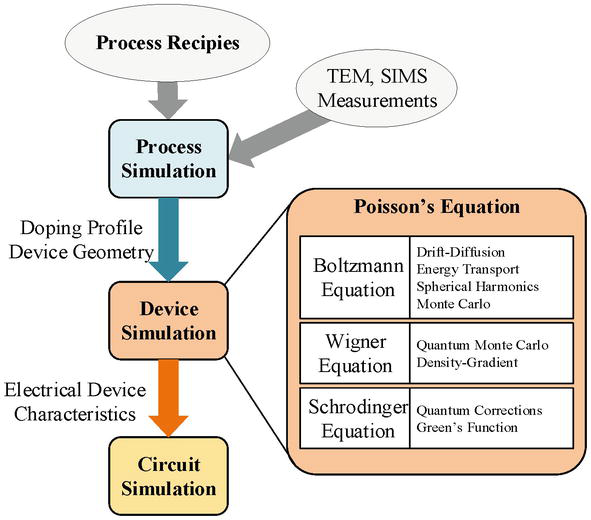
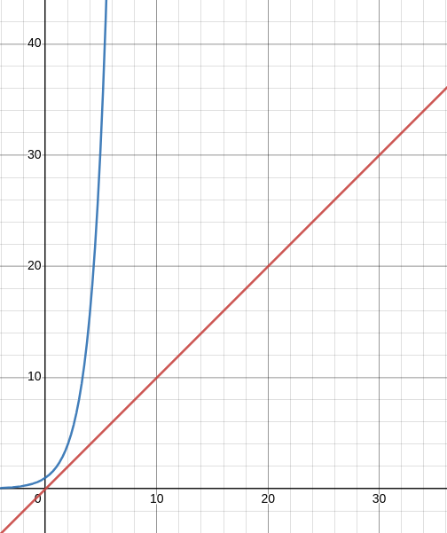
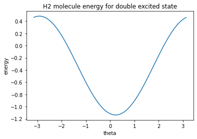

<script src="https://cdn.mathjax.org/mathjax/latest/MathJax.js?config=TeX-AMS-MML_HTMLorMML" type="text/javascript"></script>


Simulation of chemical processes is one of the most promising applications of quantum computers, fields such as drug discovery can use simulations to solve complex problems at a faster rate. We will look at why quantum computers have an advantage over classical computers in the field of molecular simulation and look at an example of simulation of $$H_2$$ using Pennylane’s `qchem` library.

# Quantum Nature of Universe

Since the dawn of quantum mechanics, it is known that the systems present in our universe, and the universe itself are quantum in nature. It can be established that since classical mechanics worked well for us for centuries, it is a good approximation on a larger scale for our universe, as things went to a smaller scale, to the molecular level, classical mechanics started to fail. This is what gave rise to quantum mechanics.

If one wants to understand & predict a system that is on a molecular level, one can’t ignore the quantum nature of particles. To achieve precise calculations and construct theories about molecules in any field, quantum mechanics must be used as the basis.

# Simulations

## Why Simulate?

Simulation of planets for example allows astronomers to calculate the chances of collisions of two different spacial bodies with great accuracy, these calculations are something that can’t be checked by actually conducting the experiment since it’s impossible to replicate the environment in any lab.

Simulating on a computer means that we are able to fully model a system and its dynamics on the computer and obtain the state of the system at any time given its initial state. Simulations are very useful for understanding different aspects of the universe and to test theories without actually conducting the experiment.

## Atomic-level Simulations

Similar to large-scale bodies, the experimentation of the behavior of particles on a molecular or atomic scale requires a lot of resources and infrastructure. Observing events on such a small scale, both in terms of space and time is often infeasible. This means that simulation is the only way of testing hypotheses about the behavior of atoms and particles in different scenarios. 

It is clear to us that to understand the dynamics of sub-atomic particles in different scenarios, we must simulate them on a computer. But what is the purpose of predicting the behavior?

### Confirming Theories

Particle physics is a sub-domain of physics that is trying to understand the sub-atomic particles of an atom and their interactions with each other, helping us model the universe completely. With the ability to predict the behavior of particles accurately, it is easier to test if a theory is correct.

In the sub-domain of quantum chemistry, the analytical solutions for the dynamics of non-trivial systems do not exist, making simulation the only way of understanding these systems. 



Geant4: Used for simulation of particles through matter

### Industrial Applications



Source: [Semiconductor Device Modeling and Simulation for Electronic Circuit Design by Samira Shamsir](https://www.intechopen.com/chapters/71973)

Simulation of semiconductor devices

The performance of materials such as semiconductors is determined by how the interactions take place at an atomic level. The availability of simulation of sub-atomic particles and atoms with high accuracy will allow the manufacturers of these materials to experiment with financial freedom since they do not have to manufacture them just to test their usability.

# Use of Quantum Computing

> “*Nature isn't classical, dammit, and if you want to make a simulation of nature, you'd better make it quantum mechanical, and by golly, it's a wonderful problem, because it doesn't look so easy.*”

Richard Feynman
> 

So far we have understood the need for the simulation of sub-atomic particles, we can model the dynamics on a normal computer and run our simulations, why bring in quantum computers at all? Well to answer that question, let’s look at the cost of simulation.

## Computational Cost

The scope of our simulation is limited to the computational power that is available to us. When dealing with systems with low complexity, this is often not a problem. Note that we mentioned low complexity and not small scale because sub-atomic systems are small scale but are quite complex. The problem arises when we want to scale our simulation for a larger number of entities of a complex system.



exponential vs linear function

For example, the simulation of one electron consumes very few computational resources. Rather than the number of resources required for one, two, or thousand of electrons, it is better to quantify the efficiency by how it scales. A classical computer can simulate electrons, which are quantum in nature with the $\exp$ complexity. For a system that has a lot of electrons, we are bound to hit the computational capacity of our computer.

These limitations are not due to shortcomings for programmers, but it is likely that this is due to the inherent hardness of quantum simulation on a classical computer, see $BQP \neq P$ for more details.

---

# Simulating Molecule’s Electronic Structure

Molecules are nothing but a quantum system, and every quantum system’s dynamics can be modeled using a Hamiltonian. Given a molecule, if we are able to construct its Hamiltonian, then it can be simulated on a quantum computer using modern techniques.

## Modeling the Molecule

> The Born-Oppenheimer Approximation is the assumption that the electronic motion and the nuclear motion in molecules can be separated. It leads to a molecular wave function in terms of electron positions and nuclear positions.
> 

The molecule will consist of interactions between nuclei and electrons, but thanks to the Born-Oppenheimer approximation, we can assume a model for the nuclei and focus primarily on electrons. The dynamics of electrons are modeled in the Electronic Hamiltonian. The equation for this is:

$$
H_e \psi(r) = E\psi(r)
$$

When describing the Hamiltonian for molecules, we represent them as a linear combination of fermionic operators, these operators are the creation and annihilation operators represented by $a_j^\dagger$ $a_j$ respectively. These operators follow the property:

$$
[a_p, a_q]_+ = 0  \newline
[a_p, a_q^{\daggger}]_+ = \delta_{pq}I
$$

Here, $[A, B]_+ = AB + BA$.

A simple example that we can consider is the harmonic oscillator, If $\{\ket{0}, \dots \ket{n-1}\}$ is the basis states set for the harmonic oscillator, then:

$$
a\ket{i} = \sqrt{i}\ket{i -1} \newline
a^{\dagger}\ket{i} = \sqrt{i+1}\ket{i +1}
$$

The general representation of an electronic Hamiltonian in second quantized form is:

$$
H = \sum_{p,q} h_{pq} a_p^\dagger a_q + \frac{1}{2} \sum_{p,q,r,s} h_{pqrs} a^\dagger_p a^\dagger_q a_ra_s
$$

The evolution for this system is given by the unitary operator $U = e^{-\iota H t}$

To determine $h_{pq}$ & $h_{pqrs}$, Hartree-Fock orbitals are evaluated. For the purpose of this post, assume that these values can be obtained for a given molecule. Now we have the Hamiltonian for our molecule ready, but it’s present in fermionic operators. How do we convert the Hamiltonian in terms of quantum bits?

## Quantum bits representation of molecular Hamiltonian

Qubits are popularly modeled as the spin of an electron or polarization of a photon, in a more general manner, you can use any two-level quantum mechanical system to model a qubit. Now if we reverse this process, we can model the spin of an electron using a single qubit on our quantum computer!

Each electron must be represented by a qubit and each orbital can hold up to two electrons, to understand more about the number of qubits required for a molecule refer [here](https://chemed.chem.purdue.edu/genchem/topicreview/bp/ch6/quantum.html).

### State vector

If the spin orbitals of the molecule are represented by binary vectors of length $N$, i.e. $$\ket{n_0, \dots n_{M-1}}$$ we can map each of these into a corresponding state vector of $N$ qubit system:

$$
\ket{n_0, \dots n_{N-1}} \rightarrow \ket{q_0\dots q_{N-1}}
$$

### Pauli Basis

Hamiltonians are strictly hermitian operators, i.e. $H = H^\dagger$. For a two-level quantum mechanical system, the Pauli operators along with the Identity operator form the basis.

$$
H = \sum_{i=0}^3 h_i \sigma_i
$$

Here, $\sigma_0 = I$. If we are able to get the Hamiltonian of the molecule in terms of the Pauli basis then we can implement the required unitary operators on our system of qubits.

### Jordan-Wigner Transformation

The conversion from fermionic operators to Pauli basis is made possible through Jordan-Wigner transformation which can be written as: 

$$
a_j \rightarrow \sigma_0^{\otimes j -1} \otimes \bigg(\frac{\sigma_1 + i\sigma_2}{2}\bigg)
\otimes \sigma_3^{\otimes N-j -1} \newline
$$

$$
a_j^\dagger \rightarrow \sigma_0^{\otimes j -1} \otimes \bigg(\frac{\sigma_1 - i\sigma_2}{2}\bigg)
\otimes \sigma_3^{\otimes N-j -1}
$$

From this point, we can use any of the already existing Hamiltonian simulation techniques. All this theory aside, now let’s use Pennylane’s `qchem` module to simulate a molecule of our choice.

# Example Simulation

## Building the Hamiltonian

Following is the tutorial to simulate a molecule, for simplicity we will be simulating a `H2` molecule, the chemical configuration of the file is given [here](https://github.com/susilehtola/erkale/blob/master/tests/xyz/H2.xyz).

```python
from pennylane import qchem

symbols, coordinates = qchem.read_structure("h2.xyz") # ensure that you have the file.
print(symbols, coordinates)
```

The output of the above code-block is: `['H', 'H'] [ 0. 0. -0.69919867 0. 0. 0.69919867]`

We have all the required information about our molecule present in `(symbols, coordinates)`. Now we will convert the given structure into a qubit Hamiltonian using [`qchem.molecular_hamiltonian`](https://pennylane.readthedocs.io/en/stable/code/api/pennylane.qchem.molecular_hamiltonian.html). 

```python
H, qubits = qchem.molecular_hamiltonian(symbols, coordinates)
print(qubits) # outputs 4
```

The loaded Hamiltonian is stored in `H` which is stored in a linear combination of local Hamiltonians represented as tensor products of Pauli operators. Each term is a pair of coefficients and a local Hamiltonian. Pauli operators are hermitian in nature, tensor product and linear combination with real coefficients of hermitian operators yield a hermitian operator.

```
(-0.22343153258410486) [Z2]
+ (-0.2234315325841048) [Z3]
+ (-0.0970662763925289) [I0]
+ (0.17141282685360795) [Z1]
+ (0.17141282685360815) [Z0]
+ (0.12062523472286929) [Z0 Z2]
+ (0.12062523472286929) [Z1 Z3]
+ (0.16592785006452096) [Z0 Z3]
+ (0.16592785006452096) [Z1 Z2]
+ (0.1686889820600755) [Z0 Z1]
+ (0.17441287527677451) [Z2 Z3]
+ (-0.04530261534165168) [Y0 Y1 X2 X3]
+ (-0.04530261534165168) [X0 X1 Y2 Y3]
+ (0.04530261534165168) [Y0 X1 X2 Y3]
+ (0.04530261534165168) [X0 Y1 Y2 X3]
```

Although $H_2$ has 2 electrons, the orbitals of the molecule can hold up to 4, so to ensure accurate simulation, it allocates 4 qubits. setting `charge = -1` would add an extra qubit onto the system. Just by importing the chemical structure and calling a function, we were able to construct the Hamiltonian for a given molecule. Now we can measure the expected value of the Hamiltonian for a given state.

## Expected value

> The expectation value of the Hamiltonian operator is the average of the energy measurements performed on a large number of identical systems.
> 

Folks familiar with physics know that Hamiltonian itself is an observable, which means repeated experimentation and measurement will give me an expected value of the observable itself. For a given Hamiltonian, the measured energy is dependent on the initial state, the state that results in the least energy is known as the ground state. Finding the ground state is a problem that is known for its great importance. Hamiltonian Simulation serves as a sub-routine to find ground-state energy.

For a given quantum state, the expected value of an observable $H$ for a given state $\ket{\psi}$ is:

$$
\langle H \rangle_{\psi}
=\bra{\psi}H\ket{\psi}
$$

We start with different start states and calculate the expected energy. For simplicity, we will not use any of the advanced methods such as Variational Quantum Eigensolver. We will also restrict ourselves to the linear combination of the Hartree-Fock state & the doubly excited states only.

The Hartree-Fock state is a state where the electrons occupy the lowest-energy orbitals whereas an excited state is a state where electrons are not in their lowest-energy orbitals, doubly excited implies that both the electrons are not in their lowest-energy orbitals.

The state we will check for is of the form:

$$
\cos(\theta/2)\ket{1100} - \sin(\theta/2)\ket{0011} 
$$

For the purpose of this post, we will use knowledge of the molecule to reduce the search space into just a linear combination of two known terms. In reality the search space is much larger and we use advanced techniques such as Variational Quantum Eigensolver.

The circuit can be constructed in pennylane as follows:

```python
dev = qml.device('default.qubit', wires=4)

@qml.qnode(dev)
def circuit(theta):
    qml.BasisState(np.array([1, 1, 0, 0]), wires=[0, 1, 2, 3])
    qml.DoubleExcitation(theta, wires=[0, 1, 2, 3])
    return qml.expval(H)
```

## Simple Solver

The most brute-force approach to find a minima of a function in a given space is to iterate over the entirety of it. Since there are infinite number of real numbers even in a small slice on the number line, we will set a precision of $0.01$ for the groundstate required. Now, we iterate our parameter $\theta$  over the slice $[-\pi, \pi]$ with the stepsize equal to precision i.e. $0.01$.

```python
min_p, min_val = np.inf, np.inf
angles = [x / 100 for x in list(range(-int(np.pi * 100), int(np.pi * 100)))]
energy = []
for theta in angles:
    params = np.array(theta, requires_grad=True)
    value = circuit(params)
    if min_val > value:
        min_p, min_val = params, value
    energy.append(value)

print(min_p, min_val) # prints 0.23 -1.137...
```

Plotting energy against angles gives us:



This graph represents the expected value of energy for the state described by $\theta$. Note that this curve has a minima at $0.23$, this means that in the given space our ground state:

$$
0.9736\ket{1100} + 0.2279\ket{0011}
$$

Since we tried finding the ground state of the molecule through a naive method which means that it will not be precise. You can explore more advanced techniques if you are interested!

# Conclusion

Using the handy tools of Pennylane, we were able to go from a chemical file for a molecule to constructing its Hamiltonian and plotting the expected value of the energy with the double excited state being the start state. This blog has just introduced you to the possibilities of quantum chemistry in terms of modeling molecules’ electronic configuration. Plenty of other applications have been made possible and efficient thanks to quantum computing, look for further reading for more exciting uses!

## Further Reading

[Vazirani notes for BQP vs P](https://people.eecs.berkeley.edu/~vazirani/f04quantum/notes/lec5/lec5.pdf)

[Quantum Computing 40 years later by John Preskill](https://arxiv.org/pdf/2106.10522.pdf)

[Preskill notes for Quantum Algorithms](http://theory.caltech.edu/~preskill/ph219/chap6_20_6A.pdf)

[Pennylane blogs on Quantum Chemistry](https://pennylane.ai/qml/demos_quantum-chemistry.html)

[Simulation of Electronic Structure Hamiltonians Using Quantum Computers](https://dash.harvard.edu/bitstream/handle/1/8403540/Simulation_of_Electronic_Structure.pdf;sequence=1)

## References

[1] Nielsen, M. A., & Chuang, I. (2002). Quantum computation and quantum information.

[2] Arrazola, Juan Miguel *et al* (2021). Differentiable quantum computational chemistry with PennyLane

[3] Whitfield, James D., Jacob Biamonte, and Alan Aspuru-Guzik. 2011. Simulation of electronic structure Hamiltonians using quantum computers.

---

## Author 
Zeeshan Ahmed, [Twitter](https://twitter.com/Zeeshan61354321)